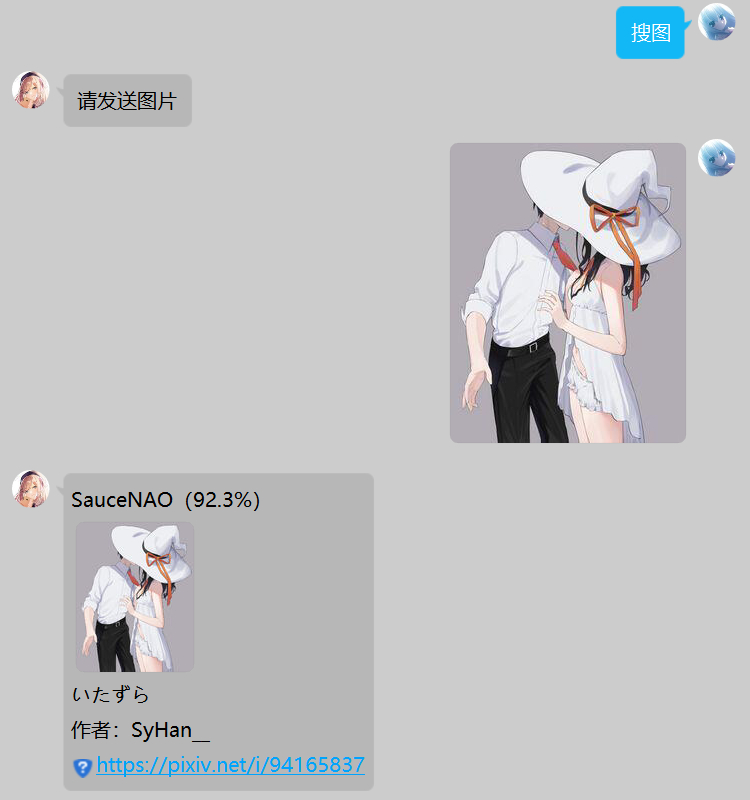
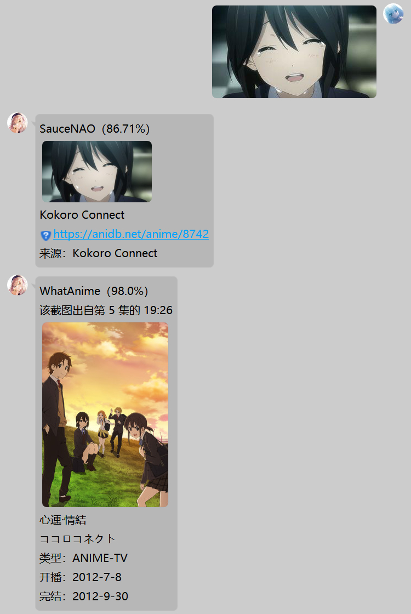
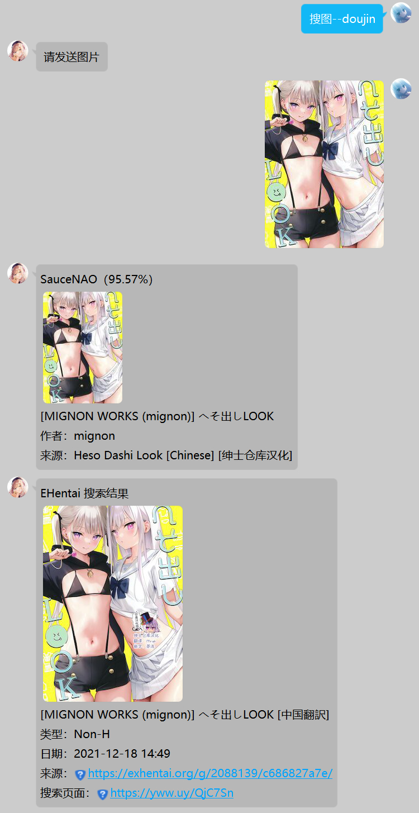

# YetAnotherPicSearch

基于 [nonebot2](https://github.com/nonebot/nonebot2) 及 [PicImageSearch](https://github.com/kitUIN/PicImageSearch) 的另一个 Nonebot 搜图插件

## 项目简介

主要受到 [cq-picsearcher-bot](https://github.com/Tsuk1ko/cq-picsearcher-bot) 的启发。我只需要基础的搜图功能，于是忍不住自己也写了一个，用来搜图、搜番、搜本子。

目前支持的搜图服务：

- [SauceNAO](https://saucenao.com)
- [Ascii2D](https://ascii2d.net)
- [Iqdb](https://iqdb.org)
- [E-Hentai](https://e-hentai.org)
- [WhatAnime](https://trace.moe)
- [Baidu](https://graph.baidu.com/)

目前适配的是 `OneBot V11` ，没适配 QQ 频道。

## 文档目录

- [使用教程](docs/使用教程.md)
- [部署教程](docs/部署教程.md)

## 效果预览

    
    
    

## 感谢名单

- [cq-picsearcher-bot](https://github.com/Tsuk1ko/cq-picsearcher-bot)
- [PicImageSearch](https://github.com/kitUIN/PicImageSearch)
- [nonebot2](https://github.com/nonebot/nonebot2)
- [go-cqhttp](https://github.com/Mrs4s/go-cqhttp)

## Star History

